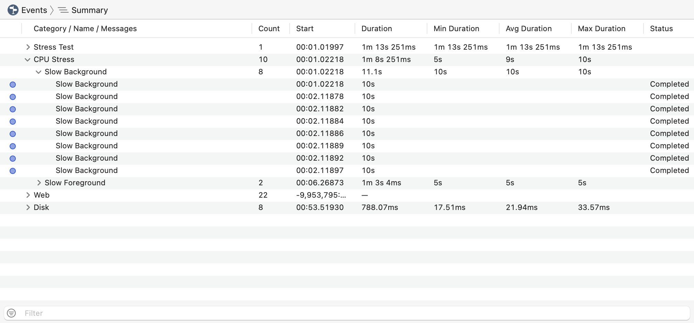

# Events Instrument

The Events instrument lets you add lightweight instrumentation to your code for collection and visualization by Detox Instruments. You can specify interesting periods of time ('intervals') and single points in time ('events'). Each event can be marked as completed, ending in error or cancelled.

For more information on developer APIs, see the [Developer API Reference](DeveloperAPIReferenceIntro.md).

### Discussion

Use the information captured by this instrument to inspect events in your app and how they correlate to other performance metrics, such as CPU and memory usage.

Events appear as segmented lines on the timeline in the timeline pane. Concurrent events will appear below each other.

### Detail Pane

The detail pane displays all your events. Samples will be highlighted in red (warning 3) when you set the event status to 'Error'.

From the navigation bar, you can display events in summary or list.

#### Summary

Events will be grouped by categories and their names. For groups, you can see the number of events, the total duration of all events in the group as well as min/avg/max duration.

#### List

Events will be displayed in a list.

### Inspector Pane

For each sample or group, the inspector pane shows information, such as status, timing and additional information provided by you in the API.

